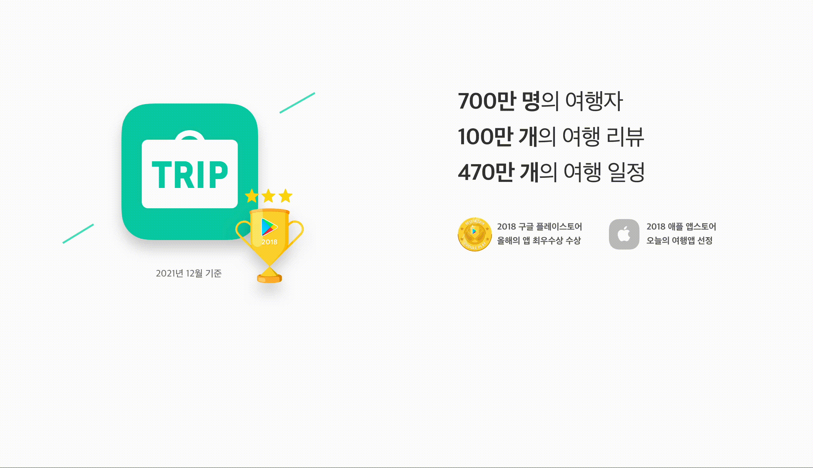

# 트리플 과제

### 프로젝트 실행 방법

1. 터미널에서 원하시는 경로로 이동하여, 다음과 같이 입력하여 프로젝트를 clone 받습니다.

```
$ git clone https://github.com/iiinhochoiii/triple_project.git
```

2. clone을 받으면 "triple_project" 폴더가 생성 되며, 해당 프로젝트로 이동합니다.

```
 $ cd triple_project
```

3. /triple_project 경로로 이동이 되었다면, node_modules 설치를 위해 다음과 같이 터미널에 입력해주세요.

```
$ npm install
```

4. node_modules이 설치 되었다면, 다음과 같이 입력하여 프로젝트를 실행 시켜 주세요.

```
$ npm start 
```

프로젝트를 실행하고, 브라우저가 자동으로 뜨지 않았다면, http://localhost:3000 으로 이동해주세요.

---

### 사용 기술과 선택한 이유

- language: React(CRA), Typescript
    - Javascript는 동적 언어로, 자유롭게 타입을 가지기  때문에 값들을 변경할 때 편리하지만, 이로 인하여 타입이 맞지 않아 얘기치 못한 오류가 발생하여 안정성을 보장하기 위해 Typescript를 사용하였습니다.

- style: Styled-components
    - 컴포넌트의 props를 참조할 수 있으며, props의 값에 따라 스타일을 다르게 줄 수 있는 장점과, css(scss)와 같이 파일을 따로 분리하여 관리를 하는 부분과 className을 지정하여 스타일 주는 부분에 대해 가독성이 다소 떨어진다고 생각하여 styled-components를 사용하게 되었습니다.

- 그 외
    - @titicaca/eslint-config-triple: 트리플의 코드 규칙을 맞추기 위해 사용하였습니다.
    - custom hooks: 현재 구현된 section은 한개 이지만, 여러개의 section이 있다고 가정하고, 반복되는 기능을 hook을 만들어 재사용하기 위해 사용하였습니다.

---

### 결과물



#### 기능 소개

- 위 이미지에서 Component는 다음과 같습니다.
    - 좌측 로고 - ContentLogo Component
    - 우측 상단 카운트 영역 - Metrics Component
    - 우측 하단 앱 수상 영역 - Awards Component
- 현재 한개의 Section만 구현되어 있어, 스크롤이 되지 않지만, 섹션이 추가 된다고 가정하고 useFadeScroll (커스텀 훅)을 만들었 습니다.
    - viewport 기준으로, 해당 section의 content가 50% 이상 보일 때, 섹션이 보이도록 활성화 (isActive = true)
    - 섹션이 보이도록 활성화가 되었을 경우에는, ContentLogo -> Metrics -> Awards 순으로 100ms 간격으로 컨텐츠가 나타나도록 구현 되었습니다.
- Metrics Component가 나타날때, useCountUpAnimation (커스텀 훅)이 동작되도록 구현하였습니다.
    - 2000ms 동안 증가 되도록 구현 되었습니다.
    - count(증가하는 숫자) 데이터는 state로 반환하지 않고, Dom의 innerHTML로 숫자 증가가 되도록 하였습니다.
    - state로 관리를 할 수 있었으나, 2초동안 state를 엄청 많이 update 시켜, 불필요한 리렌더링이 발생한다고 생각 되어, dom으로 숫자를 증가 시켰습니다.
- 문구 (text), Style은 홈페이지와 동일하게 구현 하였습니다.

---

### 디렉토리 구조

```
├── @types
│   └── index.d.ts // styled-components의 타입 추론을 돕는 파일
│
├── components
│   ├── layouts   // 공통 컴포넌트 layout
│   │    └── MainLayout.tsx
|   |
│   └── sections  // 구현된 section 영역
│       ├── Awards.tsx    // 우측 하단 (앱 수상)
│       ├── ContentLogo.tsx   // 좌측 영역
│       ├── Metrics.tsx   // 우측 상단 (카운트)
│       └── style // 섹션에서 공통적으로 사용되고 있는 스타일
│            └── fadeStyle.ts
│
├── constants
│   └── imageUrl.ts   // image url에 대한 상수값
│
├── hooks
│   ├── useCountUpAnimation.tsx // 숫자 증가 시키는 훅
│   └── useFadeScroll.tsx // 스크롤 감지 하여 컨텐츠 활성화(fade) 시키는 훅
│
├── interfaces
│   └── Fade.ts   // Fade 관련된 타입
│
├── pages
│   ├── index.tsx // 실제 화면에 보이게 되는 page
│   └── notFound.tsx // 잘못된 경로로 라우팅 되었을 때 보이는 page
│
├── styles
│   ├── global-styles.ts // 전역 스타일
│   └── theme.ts // styled-component에서 props.theme에 해당하는 스타일(color) 정의
├──
```